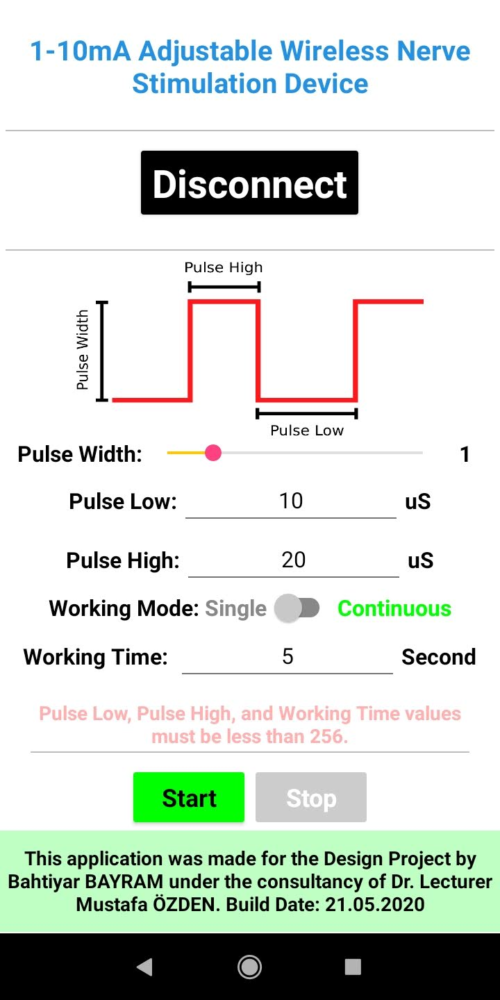
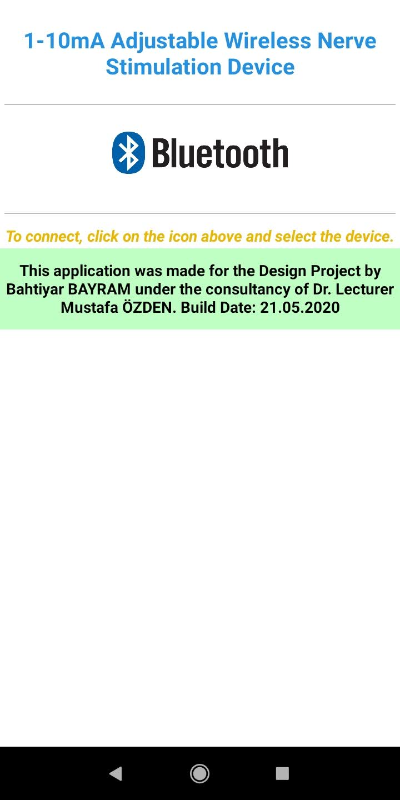
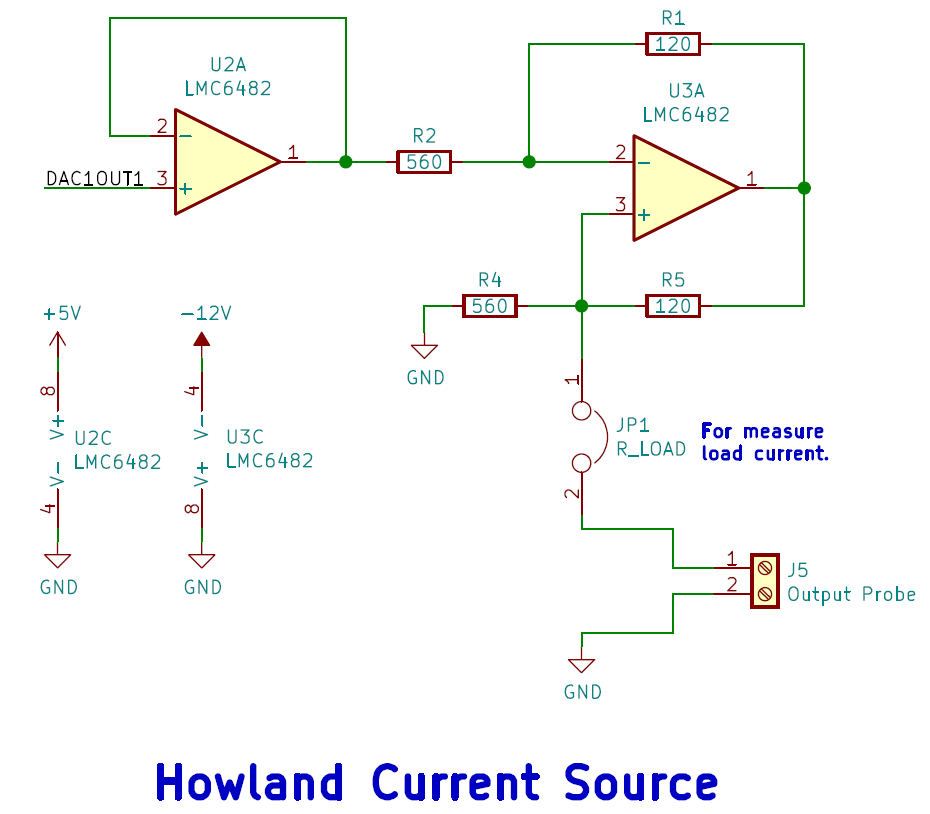
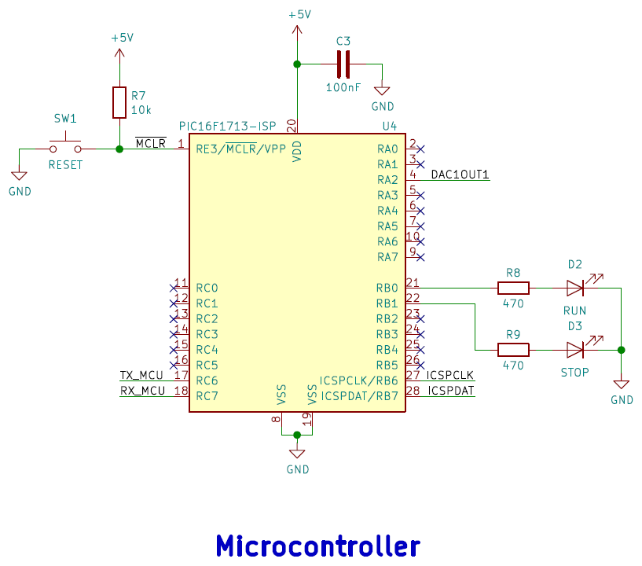
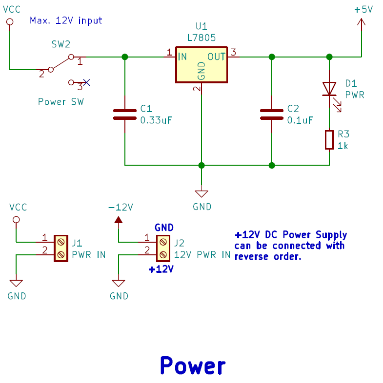
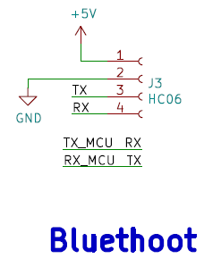
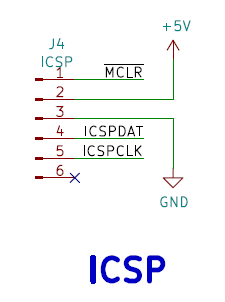
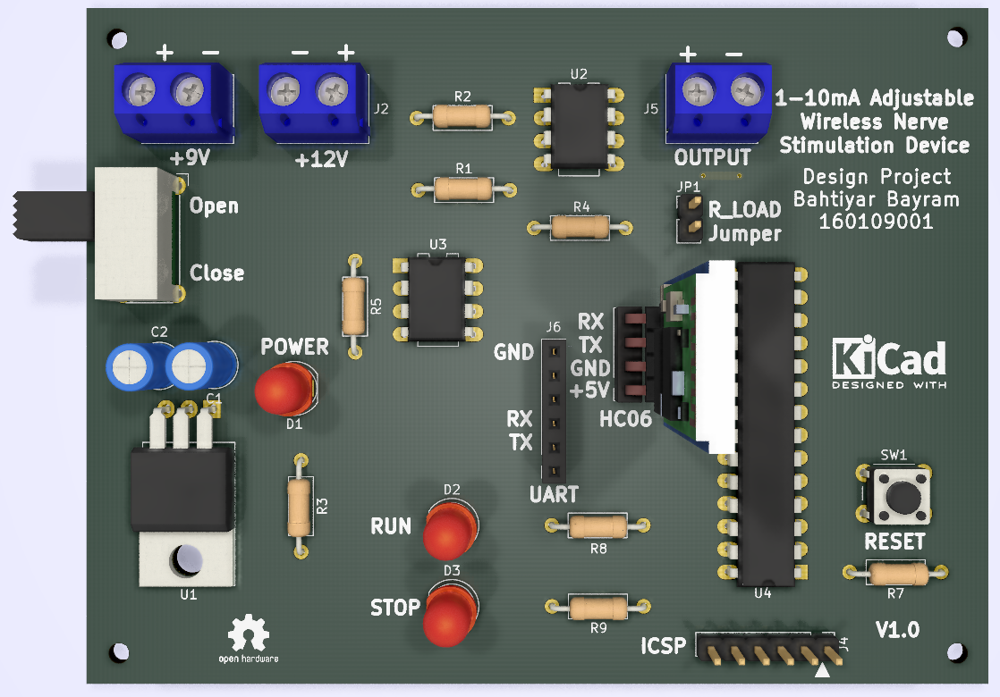
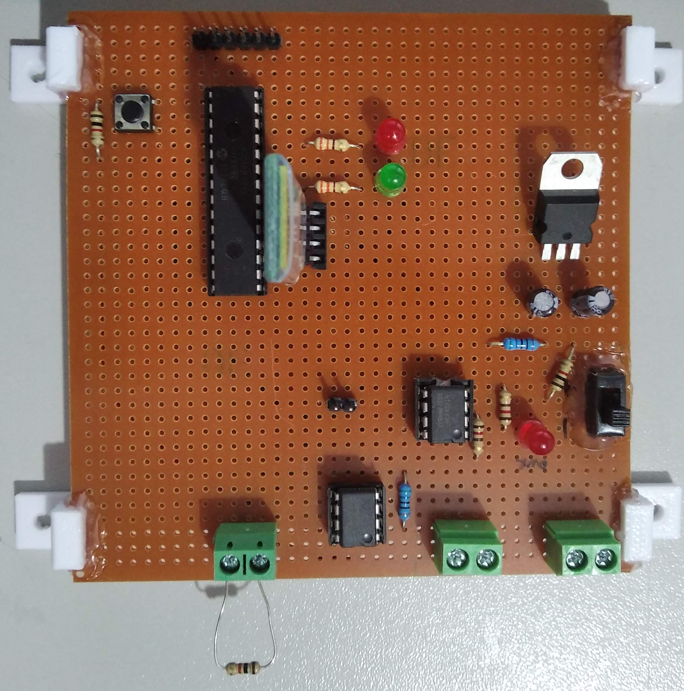

# Adjustable Wireless Neuro Stimulator System
This project is made for the Design Project lecture. With this system, you can control output current by using Android application which made with [App Inventor](http://ai2.appinventor.mit.edu/).
### Notes
- The maximum output current is 5.5mA.
- The maximum Pulse High, Pulse Low, and Working Time values on the application are 255.
- Current source and system power supplies must not share the same ground.

## Used Microcontroller Features
In the software used PIC16F1713 microcontroller features listed below.
- DAC
- EUSART
- Timer0
- Interrupt

## Components
- 1x PIC16F1713 Microcontroller
- 1x HC-06 Bluethoot Module
- 2x LMC6482IN Amplifier
- 1x L7805 5V Regulator
- 3x Screw Terminal
- +12V DC Power Supply (for the current source)
- +7V - +12V DC Power Supply or Battery (for the system)
- 2x 120 Ohm Resistor
- 2x 560 Ohm Resistor
- 3x 1k Ohm Resistor
- 2x 330 Ohm Resistor
- 2x 10uF Capacitor
- 2x Red LED
- 1x Green LED
- Others (Button, pin header, switch)

## App
| Disconnected App  | Connected App |
| :-------------: | :-------------: |
|   |   |

## Schematic
|   |  |
| :-------------: | :-------------: |
|   |   |
|   |   |
|   |   |

## 3D Design

## Product

